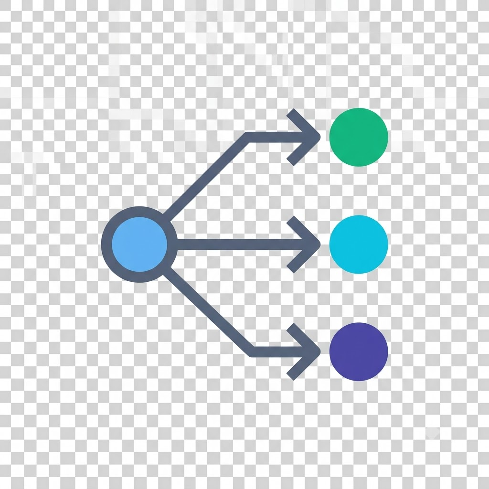

<div align="center">



# Agentic Router Provider for Copilot

**The client-side adapter that connects GitHub Copilot Chat to [AgenticRouter](https://github.com/davidpizon/agent-as-a-router)** 🔥

</div>

[](https://github.com/davidpizon/oai-compatible-copilot/actions)
[](https://github.com/davidpizon/oai-compatible-copilot/blob/main/LICENSE)

## Why this exists

VS Code's Copilot Chat model picker only knows how to talk to a fixed set of built-in providers. This extension registers itself as an additional `LanguageModelChatProvider` that exposes **exactly one model** to Copilot Chat — the Agentic Router — and forwards every request through it.

That single model points at whatever endpoint you set in `oaicopilot.baseUrl`. By running a **Custom Agentic Router** such as [**AgenticRouter**](https://github.com/davidpizon/agent-as-a-router), a local reverse proxy that fronts multiple backend models behind one OpenAI-compatible endpoint and picks which model handles each request under a performance/cost tradeoff, this extension is what makes it easy to configure VS Code to use it. AgenticRouter (like most system/local proxies) expects clients to be pointed at it explicitly via `base_url`; Copilot Chat has no built-in way to do that, so this extension is the piece that fills the gap. In that setup:

- VS Code / Copilot Chat stays the editor-side UI, talking to one model in the picker.
- This extension is the connective layer — set `oaicopilot.baseUrl` to your AgenticRouter proxy address (e.g. `http://127.0.0.1:5001/v1`) and it forwards chat requests, tool calls, and streaming responses to it.
- AgenticRouter decides what happens next: which backend model actually handles the request and what comes back. **The fan-out across many models lives server-side in the router, not in this extension.**

The extension itself doesn't implement routing logic — that's AgenticRouter's job. What it provides is the standards-compliant bridge and the settings/UI to configure the one endpoint. You can also point it directly at a single OpenAI, Ollama, Anthropic, or Gemini endpoint when you don't need a router at all — just pick the protocol with `oaicopilot.apiMode`.

## ✨ Features
- **One model, any protocol**: a single configured model that can speak OpenAI, OpenAI-Responses, Ollama, Anthropic, or Gemini via `oaicopilot.apiMode`
- **Auto-retry**: Handles API errors (429, 500, 502, 503, 504) with exponential backoff
- **Token usage**: Real-time token counting from the status bar
- **Git integration**: Generate commit messages directly from source control
- **Tools optimization**: Optimize agent `read_file` tool handling, avoid reading small chunks for large files.

## Requirements
- VS Code 1.104.0 or higher.

## ⚡ Quick Start

Setup means giving the extension a connection string (`baseUrl`) to [AgenticRouter](https://github.com/davidpizon/agent-as-a-router)'s local proxy.

1. Install the OAI Compatible Provider for Copilot extension [here](https://marketplace.visualstudio.com/items?itemName=davidpizon.oai-compatible-copilot).
2. Open VS Code Settings and set `oaicopilot.baseUrl`, `oaicopilot.modelId`, and (if needed) `oaicopilot.apiMode`.
3. Run "OAICopilot: Set OAI Compatible Apikey" from the Command Palette to store your API key.
4. Open GitHub Copilot Chat and pick the model from the model picker — the single configured model is selected by default.

### Settings Example

```json
"oaicopilot.baseUrl": "http://127.0.0.1:5001/v1",
"oaicopilot.modelId": "agentic-router",
"oaicopilot.modelName": "Agentic Router",
"oaicopilot.apiMode": "openai"
```

## ✨ Configuration UI

The extension provides a visual configuration panel for the single model without editing JSON by hand.

### Opening the Configuration UI

There are two ways to open the configuration interface:

1. **From the Command Palette**:
   - Press `Ctrl+Shift+P` (or `Cmd+Shift+P` on macOS)
   - Search for "OAICopilot: Open Configuration UI"
   - Select the command to open the configuration panel

2. **From the Status Bar**:
   - Click on the "OAICopilot" status bar item in the bottom-right corner of VS Code

The panel edits the same flat settings described below (base URL, API key, model id, display name, API mode) plus retry, delay, and commit-language options. Save writes them to your global settings and stores the API key in VS Code SecretStorage.

## ✨ API Mode

The single model can speak five different API protocols. Choose which one to use with the top-level `oaicopilot.apiMode` setting.

| `apiMode` | Endpoint | Auth header | Use for |
|---|---|---|---|
| `openai` (default) | `/chat/completions` | `Authorization: Bearer <apiKey>` | Most OpenAI-compatible endpoints (AgenticRouter, ModelScope, SiliconFlow, ...) |
| `openai-responses` | `/responses` | `Authorization: Bearer <apiKey>` | OpenAI Responses API and compatible gateways |
| `ollama` | `/api/chat` | `Authorization: Bearer <apiKey>` (optional for local Ollama) | Local Ollama instances |
| `anthropic` | `/v1/messages` | `x-api-key: <apiKey>` | Anthropic Claude endpoints |
| `gemini` | `/v1beta/models/{model}:streamGenerateContent?alt=sse` | `x-goog-api-key: <apiKey>` | Google Gemini endpoints |

Each API mode uses different message-conversion logic internally to match the provider-specific request/response format (tools, images, thinking). When using `ollama` mode you can omit the API key (defaults to `ollama`).

## Settings Reference

The extension is configured entirely through flat `oaicopilot.*` settings — there is a single model and a single API key.

| Setting | Type | Description |
|---|---|---|
| `oaicopilot.baseUrl` | string | Base URL of the Agentic Router (or any OpenAI-compatible) endpoint. All requests are sent here. |
| `oaicopilot.modelId` | string | The model id sent (as the `model` field) upstream and shown in the Copilot model picker. Defaults to `agentic-router`. Set to a configured route name (e.g. `gpt-5.4`) for normal multi-model routing; empty exposes no model. Edit via `settings.json` — not shown in the configuration UI. |
| `oaicopilot.modelName` | string | (Optional) Display name shown in the picker. Defaults to the model id. |
| `oaicopilot.apiMode` | enum | Protocol used to talk to the endpoint (see [API Mode](#-api-mode)). Default `openai`. |
| `oaicopilot.apiKey` | secret | Stored via the "OAICopilot: Set OAI Compatible Apikey" command or the config UI (not a settings.json key). |
| `oaicopilot.allowInsecureTls` | boolean | Skip TLS certificate verification — only for `localhost`/`127.0.0.1`/`::1` endpoints (e.g. a local dev proxy with a self-signed cert). Never applied to remote hosts. Default `false`. |
| `oaicopilot.warnOnHttp1` | boolean | Warn (once per host, via a notification + log) when a request connects over HTTP/1.1 instead of negotiating HTTP/2. Requests work either way — HTTP/2 is opportunistic. Default `true`. |
| `oaicopilot.retry` | object | Retry behavior for API errors (`enabled`, `max_attempts`, `interval_ms`, `status_codes`). |
| `oaicopilot.delay` | number | Minimum delay in ms between consecutive requests. Default `0`. |
| `oaicopilot.commitLanguage` | string | Language for generated Git commit messages. Default `English`. |
| `oaicopilot.commitMessagePrompt` | string | Custom system prompt for commit message generation. |
| `oaicopilot.readFileLines` | number | Lines to read with the `read_file` tool (`0` = let the model decide). |
| `oaicopilot.logLevel` | enum | Debug log level written to `~/.copilot/oaicopilot/logs/`. Default `off`. |

## Thanks to

Thanks to all the people who contribute.

- [Contributors](https://github.com/davidpizon/oai-compatible-copilot/graphs/contributors)
- [Hugging Face Chat Extension](https://github.com/huggingface/huggingface-vscode-chat)
- [VS Code Chat Provider API](https://code.visualstudio.com/api/extension-guides/ai/language-model-chat-provider)

## Support & License
- Open issues: https://github.com/davidpizon/oai-compatible-copilot/issues
- License: MIT License Copyright (c) 2026 David Pizon
